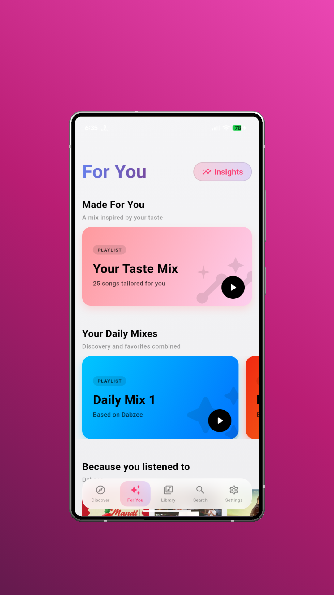
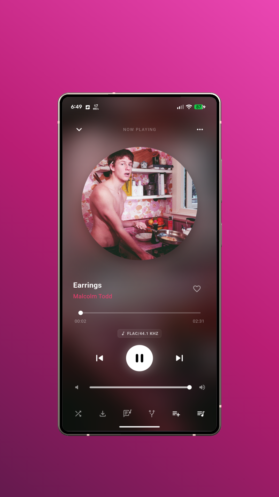

<p align="center">
  
</p>

<h1 align="center">Isai</h1>
<p align="center">A premium music player powered by TorBox — stream FLACs and high-quality audio from multiple sources.</p>

<p align="center">
  
  
</p>

---


## 🌟 Features

- 🎵 **Multi-source Streaming** — Jiosaavn, MassTamilan, Internet Archive.
- 📚 **TorBox Library Integration** — Stream your TorBox files directly without downloading.
- 🔀 **Smart Source Selection** — Auto-picks the best quality match per track.
- 📋 **YouTube Playlist Import** — Import external playlists directly as local playlists.
- 💿 **Album & Artist Browsing** — Powered by the iTunes Search API.
- 🎨 **Apple Music-inspired UI** — Glassmorphism design system, dark/light mode, animated now-playing screen.
- 📥 **Local Downloads** — Download tracks directly to your device storage.
- 🔁 **Queue Management** — Play albums/playlists with full queue support, reordering, and shuffle.
- 📝 **Synced Lyrics** — Real-time synced lyrics display when playing tracks.
- 🔌 **Dynamic Plugin System** — Scalable JavaScript-based scraper plugins to load new music sources on the fly.
- 📻 **Last.fm Scrobbling** — Scrobble your plays dynamically to your Last.fm profile.
- 🌌 **Eclipse Addon Support** — Integrates seamlessly with Eclipse addons for expanded streaming catalogs.
- 🔄 **In-App Updates** — Detects new updates and allows users to download and update directly within the app.


---

## 📱 Requirements

- Android 7.0+ (Nougat)
- Flutter SDK 3.x
- A [TorBox](https://torbox.app) account and API key *(optional — can be skipped to use external streaming sources only)*

---

## 🚀 Getting Started

To get a local copy up and running, follow these simple steps:

```bash
# Clone the repository
git clone https://github.com/Abinanthankv/Isai.git
cd Isai

# Install dependencies
flutter pub get

# Run the app on an active emulator or device
flutter run
```

To build a release APK:

```bash
flutter build apk --release
```

---

## ⚙️ Configuration

1. **TorBox Integration**: On first launch, enter your **TorBox API key** (found at [torbox.app](https://torbox.app) → Account → API Keys). You can also skip this step to run solely on streaming sources.
2. **Music Sources**: Toggle individual streaming providers (YouTube, Tidal, MassTamilan, Archive.org) in **Settings → Music Sources**.

---

## 🛠️ Tech Stack

| Layer | Technology | Description |
|---|---|---|
| **Framework** | Flutter + Dart | Cross-platform UI development |
| **State Management** | Riverpod | Clean architecture state management |
| **Audio Engine** | `just_audio` + `audio_service` | High-fidelity audio playback and OS media controls |
| **Database** | Drift (SQLite) | Fast and type-safe local storage |
| **Network Client** | Dio | HTTP requests and connection manager |
| **YouTube Scraper** | `youtube_explode_dart` | Metadata and streaming URL retrieval for YouTube |
| **Metadata** | iTunes Search API | High-resolution track, album, and artist metadata |
| **Plugin Host** | `flutter_js` (QuickJS) | Sandboxed plugin runtime for scrapers |

---

## ⚖️ Legal & Disclaimer

Isai functions solely as a client-side interface for browsing metadata and playing media provided by user-installed extensions and/or user-provided sources. It is intended for content the user owns or is otherwise authorized to access.

Isai is not affiliated with any third-party extensions, catalogs, sources, or content providers. It does not host, store, or distribute any media content.

For comprehensive legal information, including our full disclaimer, third-party extension policy, and DMCA/Copyright information, please see the [LICENSE](LICENSE) file.

